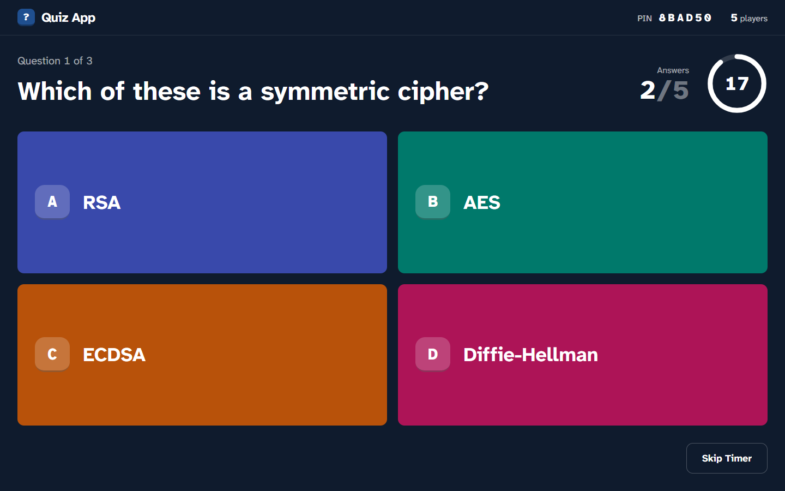
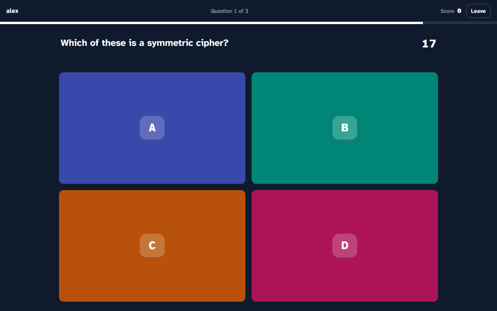
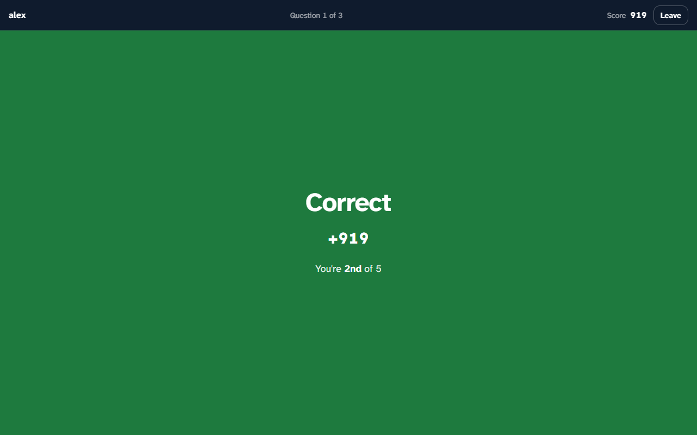
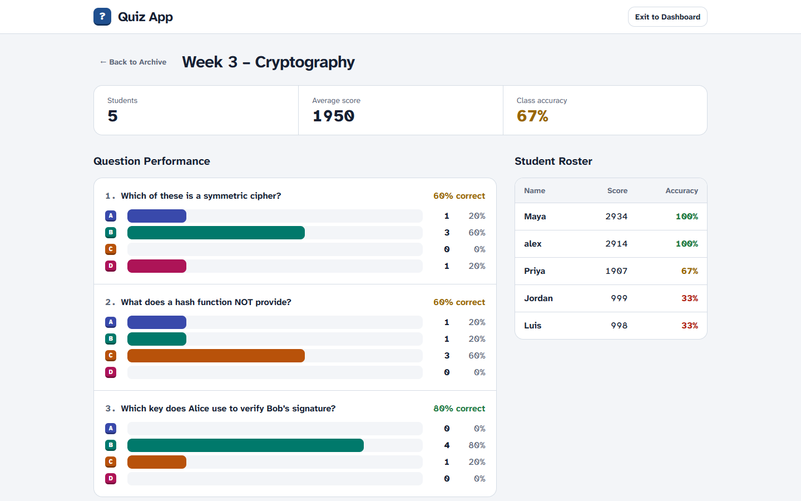
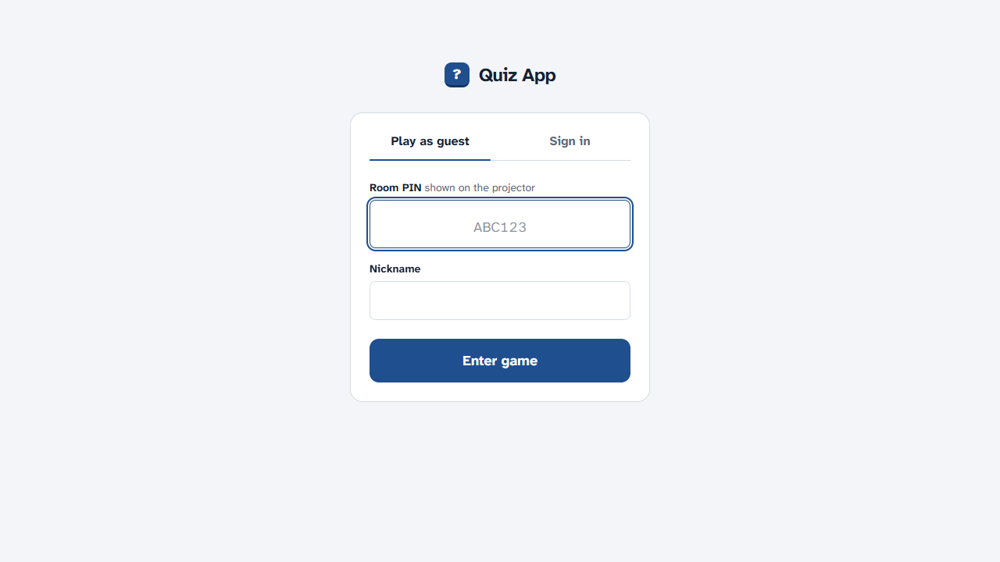
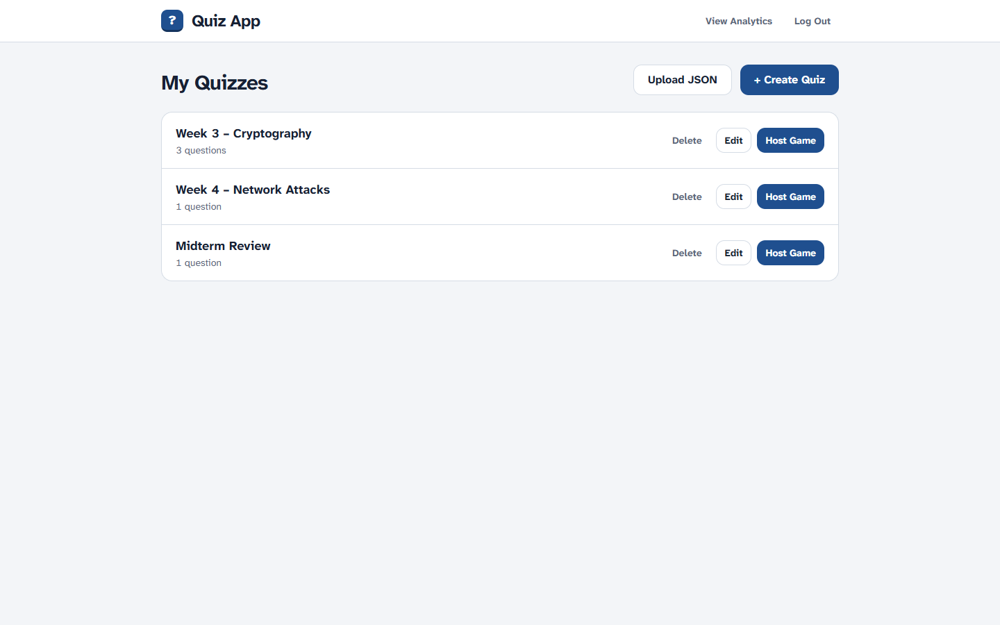
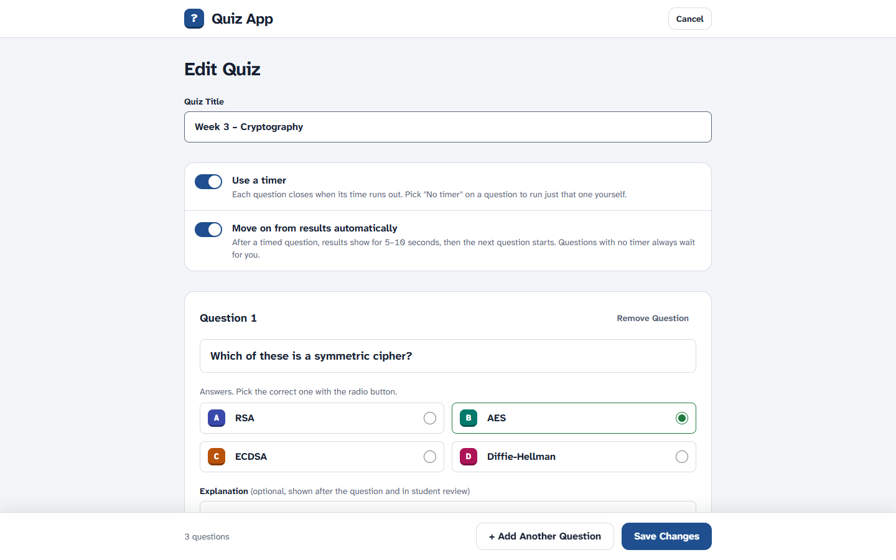
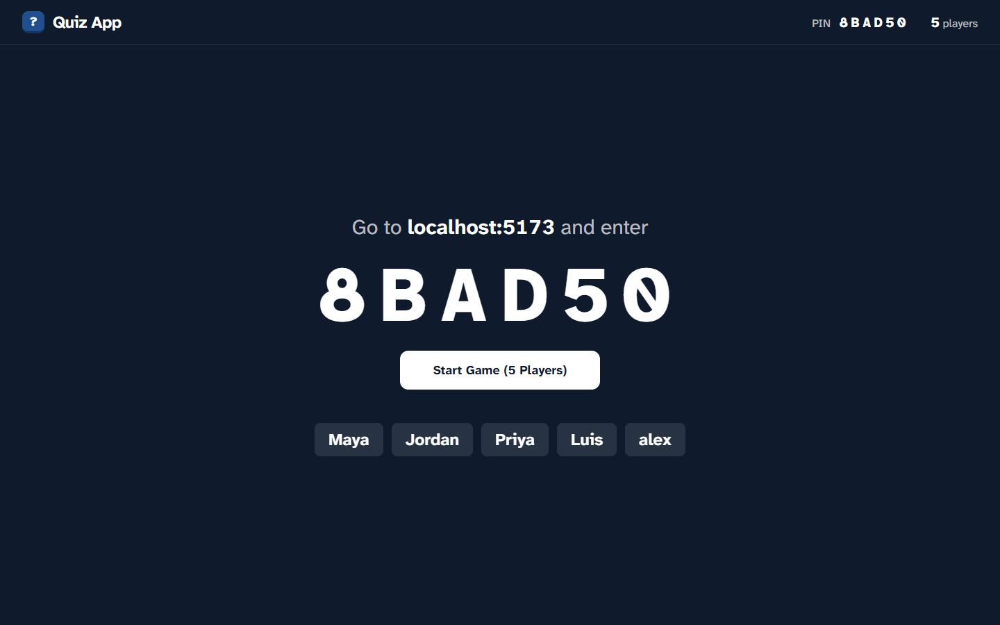

# Quiz App – CST 315

[](https://github.com/amberkar-harsh-02/cst315-kahoot/actions/workflows/ci.yml)
[](https://github.com/amberkar-harsh-02/cst315-kahoot/actions/workflows/deploy.yml)

A live classroom quiz for CST 315 (Introduction to Cybersecurity). The professor runs a game on the projector, and students answer from their own browser with a room PIN.



| Student answers by letter | Result after each question | Class results |
| --- | --- | --- |
|  |  |  |

For how the app works inside (game flow, WebSocket events, scoring, data model), see [docs/HOW-IT-WORKS.md](docs/HOW-IT-WORKS.md).

## Requirements

- Python 3.10 or newer
- Node.js 20.19 or newer (needed by Vite 8)

## 1. Start the backend

From the project root:

```bash
python -m venv venv
venv\Scripts\activate            # macOS/Linux: source venv/bin/activate
pip install -r requirements.txt
```

Create a `.env` file next to `main.py`:

```ini
SECRET_KEY=paste-a-long-random-string-here
PROFESSOR_EMAILS=you@csumb.edu
GOOGLE_CLIENT_ID=your-client-id.apps.googleusercontent.com
```

| Variable | Required | What it does |
| --- | --- | --- |
| `SECRET_KEY` | Yes | Signs login tokens. Generate one with `python -c "import secrets; print(secrets.token_urlsafe(48))"`. |
| `PROFESSOR_EMAILS` | Yes, to host games | Comma-separated emails that get professor rights, e.g. `prof@csumb.edu,ta@csumb.edu`. Everyone else is a student. |
| `GOOGLE_CLIENT_ID` | Only for "Sign in with Google" | OAuth client ID from Google Cloud Console. |
| `FRONTEND_ORIGIN` | No | Origins allowed to call the API. Leave it out for local use; any page on port 5173 is allowed. |

Then start the server:

```bash
uvicorn main:app --reload
```

The API runs on `http://127.0.0.1:8000`. The database file `kahoot.db` is created on first start.

## 2. Start the frontend

In a second terminal:

```bash
cd frontend
npm install
npm run dev
```

Open `http://localhost:5173`.

If you use Google sign-in, create `frontend/.env.local` with the same client ID:

```ini
VITE_GOOGLE_CLIENT_ID=your-client-id.apps.googleusercontent.com
```

## 3. Play a game

1. **Sign in as the professor.** On the start page, open **Sign in**, click **Need an account? Sign up**, and register with an email listed in `PROFESSOR_EMAILS`. Then sign in. You land on **My Quizzes**.
2. **Add a quiz.** Click **+ Create Quiz** to build one, or **Upload JSON** to import a file (format below).
3. **Host it.** Click **Host Game**. The projector view shows the room PIN.
4. **Join as students.** Open `http://localhost:5173` in other tabs, enter the PIN and a nickname under **Play as guest**. Students with a `@csumb.edu` account can sign in instead, which saves their results for review.
5. **Start.** Click **Start Game**. Each question closes when the timer runs out or everyone has answered. The projector then shows the answer spread, the explanation and the top 3.
6. **Review.** After the last question, results are saved. Open **View Analytics** for per-question and per-student results.

| Start page | My Quizzes | Quiz builder |
| --- | --- | --- |
|  |  |  |



**Testing on one laptop:** normal tabs share one login. Use a private window for each extra signed-in student, or play as guests.

## Quiz JSON format

```json
{
  "title": "Week 3 – Cryptography",
  "questions": [
    {
      "text": "Which of these is a symmetric cipher?",
      "option_red": "RSA",
      "option_blue": "AES",
      "option_yellow": "ECDSA",
      "option_green": "Diffie-Hellman",
      "correct_option": "blue",
      "time_limit_seconds": 20,
      "explanation": "AES uses the same secret key to encrypt and decrypt."
    }
  ]
}
```

| Field | Required | Notes |
| --- | --- | --- |
| `title` | Yes | Quiz name shown on the dashboard. |
| `text` | Yes | The question. |
| `option_red` … `option_green` | Yes | The four answers, shown to players as **A, B, C, D** in that order. |
| `correct_option` | Yes | `red`, `blue`, `yellow` or `green` (A, B, C or D). |
| `time_limit_seconds` | No | 5–120, default 15. |
| `explanation` | No | Shown on the projector after the question and in the student's review. |

A file with a missing field or a bad value is rejected with a message naming the field. Nothing is saved.

## Running the tests

```bash
pip install -r requirements-dev.txt
pytest -q
```

The tests use an in-memory database and never touch `kahoot.db`. For the frontend, run `npm run lint` and `npm run build` inside `frontend/`.

## Deployment

The live app runs at `https://secotterlab.org/quiz-app/`. GitHub Actions tests every change and deploys `main`:

| Workflow | Runs on | What it does |
| --- | --- | --- |
| **CI** (`.github/workflows/ci.yml`) | Every push to other branches, and every pull request | Backend tests on Python 3.10 (same as the server), frontend lint and build |
| **Deploy** (`.github/workflows/deploy.yml`) | Every push to `main`, or **Actions → Deploy → Run workflow** | Runs CI first. If it passes: builds the frontend, uploads it and the backend files to the server, restarts the `quiz-app` service and checks the site responds |

Deploying restarts the backend, which ends any game in progress. Merge to `main` between classes.

**On the server** (`ubuntu@15.204.118.48`):

- **Backend:** `~/quiz-app`, with its own `venv` and `.env`, run by the systemd service `quiz-app` on `127.0.0.1:8000`.
- **Frontend:** `/var/www/secotterlab.org/quiz-app`.
- **Caddy:** forwards `/quiz-app/api/*` to the backend and serves everything else under `/quiz-app/` from that folder.
- **Never touched by deploys:** `.env`, `kahoot.db` and the server's `venv`.

**GitHub settings** (Settings → Secrets and variables → Actions; environment `production`):

| Name | Type | Value |
| --- | --- | --- |
| `DEPLOY_HOST` | Secret | Server IP |
| `DEPLOY_USER` | Secret | `ubuntu` |
| `DEPLOY_SSH_KEY` | Secret | Private half of the deploy-only SSH key |
| `DEPLOY_KNOWN_HOSTS` | Secret | Output of `ssh-keyscan <server IP>` |
| `VITE_GOOGLE_CLIENT_ID` | Variable | Google OAuth client ID (public; it ships in the page) |

## Troubleshooting

| Problem | Fix |
| --- | --- |
| Signing in opens the student dashboard instead of **My Quizzes** | Your email isn't in `PROFESSOR_EMAILS`, or the server was started before you added it. Restart `uvicorn` (`--reload` doesn't watch `.env`), then log out and sign in again. |
| "Could not reach the game server" | The backend isn't running on port 8000. Start `uvicorn`, or set `VITE_API_URL` in `frontend/.env.local` if it runs elsewhere. |
| "This quiz has been played, so it can't be edited" | Played quizzes are locked so saved grades stay correct. Use **Save as a new quiz** in the editor to make a changed copy. |
| Need a clean start | Stop the server and delete `kahoot.db`, `kahoot.db-wal` and `kahoot.db-shm`. |
