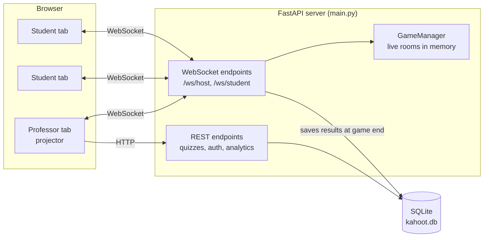
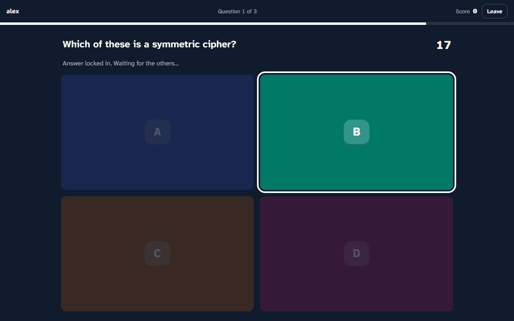
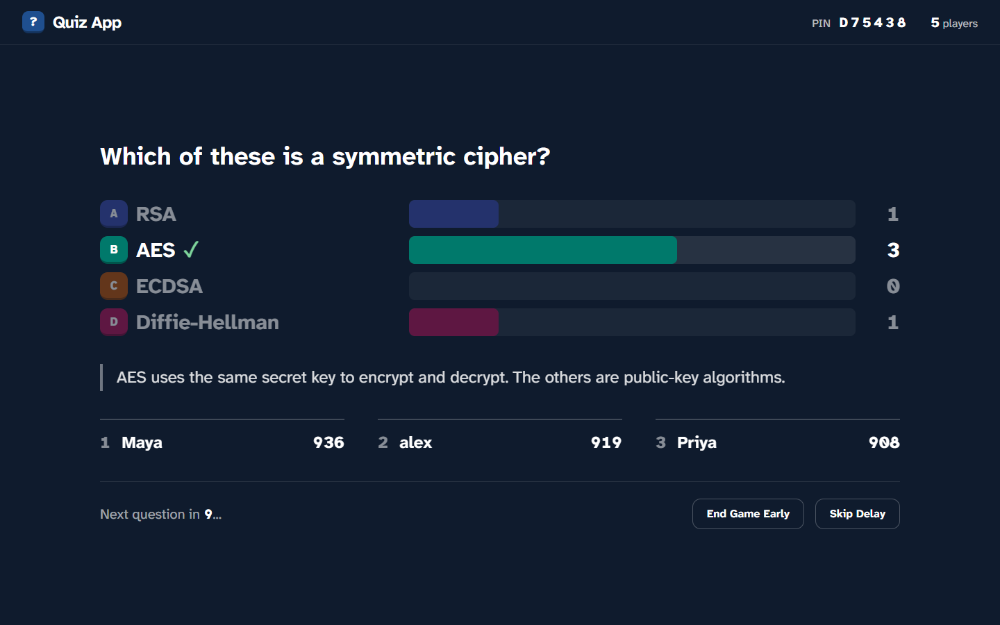
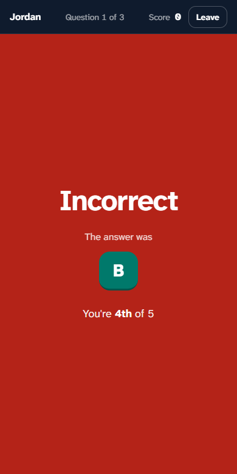
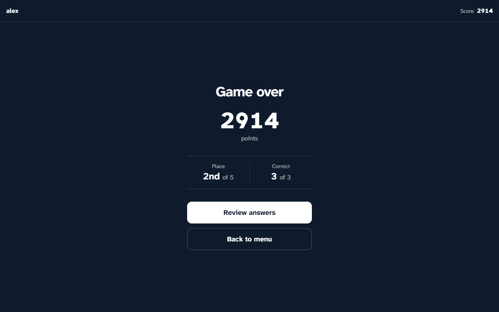
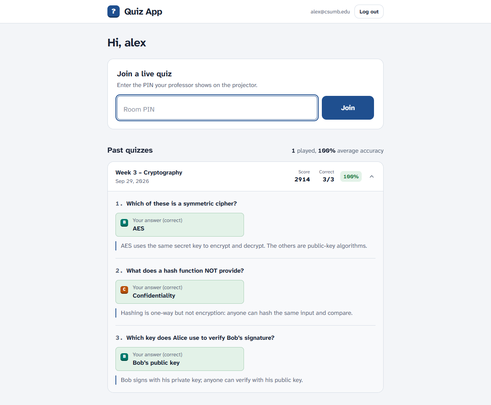
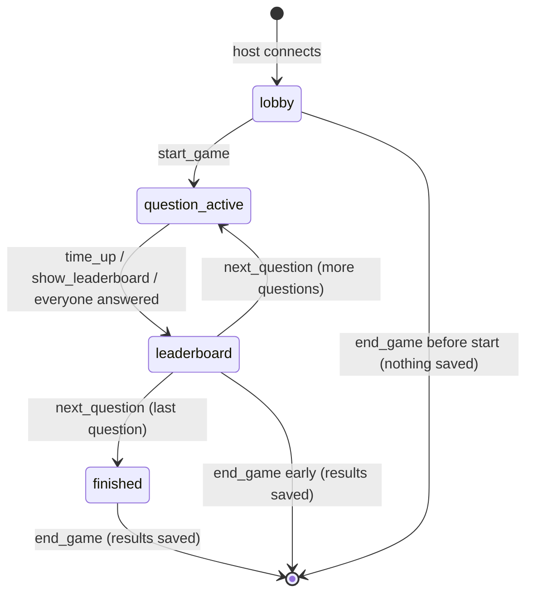
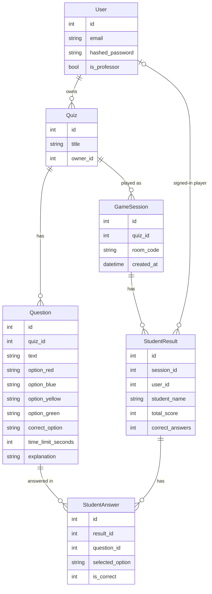

# How the Quiz App works

This document explains how the app is put together: who does what, how a live game moves between screens, what the server and browsers send each other, and how scores and data are stored. For setup, see the [README](../README.md).

## Contents

- [Overview](#overview)
- [Roles and sign-in](#roles-and-sign-in)
- [A game from start to finish](#a-game-from-start-to-finish)
- [WebSocket messages](#websocket-messages)
- [Scoring and the timer](#scoring-and-the-timer)
- [Reconnecting](#reconnecting)
- [What each side can see](#what-each-side-can-see)
- [REST API](#rest-api)
- [Data model](#data-model)
- [Project layout](#project-layout)
- [Tests](#tests)

## Overview



- The **backend** (`main.py`) is a FastAPI app. REST endpoints handle accounts, quizzes and analytics. Two WebSocket endpoints run live games.
- **Live games are held in memory** by `GameManager` (`game_manager.py`): one room per hosted game, keyed by a 6-character PIN. Nothing about a game is written to the database until the game ends.
- The **frontend** (`frontend/`) is a React app built with Vite and Tailwind. It talks to the backend over HTTP and WebSockets. `frontend/src/api.js` holds the base URLs and a small `fetch` wrapper.

## Roles and sign-in

| Role | How they get it | What they can do |
| --- | --- | --- |
| Professor / TA | Email listed in `PROFESSOR_EMAILS` in `.env` | Create, upload, edit and delete quizzes, host games, view analytics |
| Signed-in student | Any `@csumb.edu` account | Play, with results saved to their history |
| Guest | No account, just a nickname | Play; results count for the session but aren't linked to an account |

- Accounts are `@csumb.edu` only, created with a password or with Google sign-in.
- Signing in returns a JWT that expires after 24 hours. It carries the email and an `is_professor` flag. The frontend keeps it in `localStorage` and sends it as a `Bearer` header.
- Professor rights come only from `PROFESSOR_EMAILS`. There is no "I am a professor" option at sign-up. If an email is added to the list later, the account is promoted the next time it signs in.
- The host WebSocket checks the token and that the professor **owns** the quiz before it opens.

## A game from start to finish

### 1. Lobby

The professor clicks **Host Game**. The browser opens `/ws/host/{quiz_id}`, and the server creates a room with a PIN. Students enter the PIN and a nickname. Each one opens `/ws/student/{PIN}` and appears as a name in the lobby.


Nicknames must be 1–20 characters and unique within the room.

### 2. Question

**Start Game** sends the first question. The projector shows the question, the four answers and a countdown ring. Each student's screen shows only the question and four letter buttons, A to D. They read the answer text off the projector.

| Projector | Student |
| --- | --- |
|  |  |

A student taps a letter and the answer locks in. The projector's answer count goes up.



### 3. Results for that question

The question closes when the timer hits zero, when everyone still connected has answered, or when the professor clicks **Skip Timer**. Then:

- The **projector** shows how many picked each answer, marks the correct one, shows the explanation and the top 3.
- Each **student** sees their own result: correct or incorrect, points earned and current place.



| Correct | Incorrect |
| --- | --- |
|  |  |

After a few seconds (10 when there's an explanation, otherwise 5) the next question starts. The professor can also click **Skip Delay** or **End Game Early**.

### 4. Game over

After the last question, the server saves the session to the database and sends every student their final score, place and number correct. The room is then deleted.



Signed-in students can open **Review answers** to see each question, their answer, the correct answer and the explanation.



The professor sees the class results in **Analytics**: accuracy per question, the answer spread and a roster.


### Room states



Each event is only accepted in the right state. For example, a second `time_up` while the results are already showing is ignored, and `next_question` does nothing while a question is still open. This stops a double click, or the timer racing the auto-skip, from skipping a question.

## WebSocket messages

All messages are JSON objects with an `event` field.

### Host (`/ws/host/{quiz_id}?token=…`)

| Direction | Event | When / contents |
| --- | --- | --- |
| server → host | `room_created` | Right after connecting. `room_code` |
| server → host | `player_joined` | A new student joined. `student_name`, `total_players` |
| server → host | `player_left` / `player_rejoined` | A student dropped or came back. Updated `total_players` and `answers_submitted` |
| host → server | `start_game` | Start the first question |
| server → host | `show_question` | `text`, `options` (the four answer texts), `time_limit`, `index`, `total` |
| server → host | `answer_received` | A student answered. `answers_submitted`, `total_players` |
| host → server | `time_up` / `show_leaderboard` | The timer ended, or the professor clicked Skip Timer |
| server → host | `leaderboard` | `top_players`, `correct_option`, `spread`, `explanation`, `is_last_question` |
| host → server | `next_question` | Go to the next question |
| server → host | `quiz_finished` | There are no more questions; the host then sends `end_game` |
| host → server | `end_game` | Save results and close the room |
| server → host | `game_over` | `session_id` of the saved session (or `null` if the game never started) |

### Student (`/ws/student/{PIN}?student_name=…&token=…&player_id=…`)

| Direction | Event | When / contents |
| --- | --- | --- |
| server → student | `join_success` | `player_id` (kept for reconnecting), `name`, `score` |
| server → student | `{ "error": … }` | Wrong PIN, nickname taken, or invalid nickname. The socket then closes. |
| server → student | `show_question` | `text`, `time_limit`, `index`, `total`. **No answer texts.** |
| student → server | `submit_answer` | `selected_option`: `red`, `blue`, `yellow` or `green` (A–D) |
| server → student | `answer_result` | `correct`, `points_earned`, `selected_option`, `correct_option`, `correct_text`, `score`, `rank`, `total_players` |
| server → student | `game_over` | `score`, `rank`, `total_players`, `correct_answers`, `total_questions`, `session_id` |
| server → student | `host_left` | The professor closed the game |

`token` is optional (guests have none). `player_id` is only sent when reconnecting.

## Scoring and the timer

- A correct answer is worth **500 points plus up to 500 for speed**: `500 + 500 × (time left ÷ time limit)`. A wrong or missing answer scores 0.
- **The server keeps the clock.** It records when each question starts and works out the time left itself when an answer arrives. Anything the browser says about time is ignored, so a student can't claim a bigger speed bonus.
- An answer that arrives more than 1 second after the time limit is dropped. The 1 second allows for network lag.
- Each student can answer each question once. An answer that isn't one of the four options is ignored.
- Ties share a place: two students with the same score are both "2nd".

## Reconnecting

Browsers drop connections: a page refresh, a laptop going to sleep, flaky Wi-Fi. The app recovers without losing the score:

1. On `join_success`, the browser saves the PIN and `player_id` in `sessionStorage`. This storage is per tab, so each tab can be a different student.
2. If the socket closes unexpectedly, the browser shows "Connection lost. Reconnecting…". It retries after 1, 2, 4, 8 and 16 seconds.
3. The retry sends the `player_id`. The server puts the student back in the same slot, with the same score, and sends the current state: the open question with the time left (and their answer, if they already locked one in), or their latest result.
4. While a student is disconnected, they're left out of the "everyone answered" count. That way the professor isn't stuck waiting for them.

If the professor's tab closes, the room is deleted and students see "Session ended".

## What each side can see

The app is for a security course, and scores can count toward grades, so these rules are enforced on the server rather than just in the UI:

- **During a question, students never receive the answer texts or the correct answer.** They get only the question text and timing. The correct answer is sent only after the question closes.
- `GET /quizzes/{id}` includes correct answers, so only the owning professor can call it.
- A professor can only host, edit, delete or view analytics for their own quizzes.
- **A quiz that has been played can't be edited or deleted.** Its saved results point at its questions, so changing it would corrupt past grades. The editor offers **Save as a new quiz** instead.
- Quiz uploads go through the same validation as the builder. A bad file is rejected as a whole, and nothing is half-saved.

## REST API

Endpoints marked 🔒 need a professor token; 👤 needs any signed-in user.

| Method | Path | Purpose |
| --- | --- | --- |
| POST | `/register` | Create an account (`@csumb.edu` only) |
| POST | `/token` | Sign in with email and password, returns a JWT |
| POST | `/google-login` | Sign in with a Google ID token, returns a JWT |
| GET | `/quizzes/` 🔒 | List your quizzes |
| GET | `/quizzes/{id}` 🔒 | One quiz with questions and answers (owner only) |
| POST | `/quizzes/builder` 🔒 | Create a quiz with all its questions |
| POST | `/quizzes/upload/` 🔒 | Create a quiz from a JSON file |
| PUT | `/quizzes/{id}` 🔒 | Replace a quiz's title and questions (409 if played) |
| DELETE | `/quizzes/{id}` 🔒 | Delete a quiz (409 if played) |
| POST | `/quizzes/` 🔒 | Create an empty quiz |
| POST | `/quizzes/{id}/questions/` 🔒 | Add one question (409 if played) |
| GET | `/sessions/` 🔒 | Past games of your quizzes |
| GET | `/analytics/{session_id}` 🔒 | Class overview, per-question stats and roster |
| GET | `/student/history` 👤 | Your past games with answers and explanations |

FastAPI also serves interactive docs at `http://127.0.0.1:8000/docs`.

## Data model



- The answer columns are named by color (`option_red`…`option_green`) for historical reasons. Everywhere in the UI they're shown as A–D, in that order. The mapping lives in `frontend/src/answers.js`.
- `StudentResult.user_id` is empty for guests.
- The database is SQLite (`kahoot.db`) in WAL mode. Tables are created on startup. `add_missing_columns()` in `database.py` adds any columns introduced later, so an older database keeps its data.

## Project layout

```
main.py                  FastAPI app: auth, REST endpoints, both WebSocket endpoints, scoring
game_manager.py          In-memory rooms: create, join, reconnect, online count, broadcast
models.py                SQLAlchemy tables
schemas.py               Pydantic request/response models, including quiz validation
database.py              SQLite engine and the add-missing-columns step
tests/                   pytest suite (in-memory database)
frontend/src/
  api.js                 API/WebSocket URLs and apiFetch (adds the token, surfaces errors)
  answers.js             Answer letters A–D and their colors
  pages/
    StudentView.jsx      Student connection logic: join, reconnect, game state
    HostDashboard.jsx    Quiz list and the host's game socket and timers
    QuizBuilder.jsx      Create and edit quizzes
    AnalyticsDashboard.jsx
  components/
    ui.jsx               Shared Button, Field, Alert, Panel, Wordmark
    AnswerKey.jsx        The A–D key badge
    student/             Join screen, dashboard, history, in-game screen
    host/                Projector views: lobby, question, reveal, game over, timer ring
docs/                    This document and the screenshots
```

The pages own the state and the sockets. The components under `components/` only display what they're given. That keeps the game logic in two places: `StudentView.jsx` and `HostDashboard.jsx`.

## Tests

```bash
pytest -q
```

The suite covers:

- **Accounts:** sign-up, sign-in, Google sign-in and professor rights.
- **Quizzes:** create, upload validation, edit and delete, including the "played quizzes are locked" rule.
- **Analytics and history**, plus the database column upgrade.
- **Full WebSocket games,** including:
  - server-side scoring (a forged time is ignored)
  - late and invalid answers dropped
  - duplicate nicknames rejected
  - reconnecting mid-question
  - students never receiving answer texts
  - the host leaving mid-game

Tests use an in-memory SQLite database, so they never touch `kahoot.db`.
